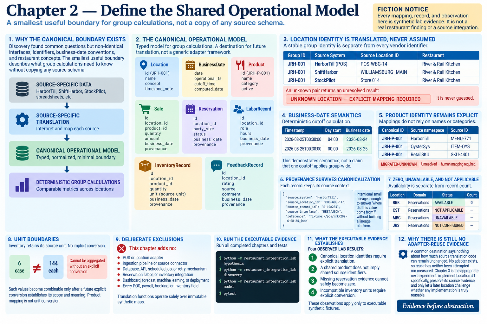

# Chapter 2 — Define the Shared Operational Model



> **Fiction notice:** Every mapping, record, and observation here is synthetic lab evidence. It is not a real restaurant finding or a source integration.

## Why the canonical boundary exists

Discovery found common operational questions but non-identical interfaces, identifiers, business-date conventions, and restaurant concepts. The smallest useful boundary therefore describes what group calculations need to know without copying HarborTill, ShiftHarbor, StockPilot, a spreadsheet, or any other source schema:

```text
SOURCE-SPECIFIC DATA
        ↓
SOURCE-SPECIFIC TRANSLATION
        ↓
CANONICAL OPERATIONAL MODEL
        ↓
DETERMINISTIC GROUP CALCULATIONS
```

The typed model contains `Location`, `BusinessDate`, `Product`, `Sale`, `Reservation`, `LaborRecord`, `InventoryRecord`, and `FeedbackRecord`. It is a destination for future translation, not a generic adapter framework. Source-specific fields remain source evidence; canonical fields exist only where later deterministic comparison needs a common meaning.

## Location identity is translated, never assumed

A stable group identity is deliberately separate from every vendor identifier. The fixtures resolve all of these explicit identities to River & Rail Kitchen:

```text
JRH-001 <- HarborTill RRK / POS-WBG-14
JRH-001 <- ShiftHarbor / WILLIAMSBURG_MAIN
JRH-001 <- StockPilot / Store 014
```

Passing `JRH-001` as though it were a HarborTill identifier does not work. An unknown pair returns an unresolved result with `UNKNOWN LOCATION — EXPLICIT MAPPING REQUIRED`; it is never guessed.

## Business-date semantics

`BusinessDate` wraps an operational `date` and provides a deterministic, explicitly configured cutoff calculation. For the synthetic timestamp `2026-08-25T00:30:00`, an operational day beginning at 04:00 produces business date `2026-08-24`, while a midnight start produces `2026-08-25`. This demonstrates semantics, not a claim that one cutoff applies group-wide. No timezone platform is introduced.

## Product identity remains explicit

The canonical product `JRH-P-001` maps from `MENU-771`, `ITEM-OYS`, and `SKU-4401` in three named source namespaces. The mappings do not rely on menu names or categories. `MIGRATED-UNKNOWN` remains unresolved and requires a human mapping; unfamiliar values never manufacture new canonical products.

## Provenance survives canonicalization

Each operational record requires a source system, source location ID, source record ID, and source interface. Optional reference metadata can identify a fixture or ingestion reference later. This is intentionally small lineage: enough to answer “where did this value come from?” without building a lineage platform.

## Zero, unavailable, and not applicable

`DomainEvidence` represents availability separately from record count. `AVAILABLE` with count `0` means evidence was available and contained no records. `UNAVAILABLE`, `NOT APPLICABLE`, and `NOT CONFIGURED` carry no count. Thus River & Rail can have **zero observed reservations**, while Canal Street Tacos is **not applicable** because Chapter 1 established that it does not take reservations. Neither state invents missing evidence.

## Unit boundaries

Inventory retains its source unit. The fixture refuses to aggregate `6 case` and `144 each`, even for the same resolved product. Such values become combinable only after a future explicit conversion establishes its scope and meaning. Product mapping is not unit conversion.

## Deliberate exclusions

This chapter adds no POS or location adapter, ingestion pipeline, source connector, reservation/labor/inventory integration, database, API, scheduled job, retry mechanism, dashboard, forecast, machine learning, or deployment system. It also does not model every POS, payroll, booking, or inventory field. Translation functions operate solely over immutable synthetic maps.

## What the executable evidence establishes

Run all completed chapters and tests:

```bash
python -m restaurant_integration_lab hypothesis
python -m restaurant_integration_lab discovery
python -m restaurant_integration_lab model
pytest
```

The demonstration records four **OBSERVED LAB RESULTS**: canonical location identities require explicit translation; a shared product does not imply shared source identifiers; missing reservation evidence cannot safely become zero; and incompatible inventory units require explicit conversion. These observations apply only to executable synthetic fixtures.

## Why there is still no adapter-reuse evidence

A common destination says nothing about how much source translation code can remain unchanged. No adapter exists, so reuse has neither been attempted nor measured. Chapter 3 is the appropriate next experiment: implement Location #1 specifically, preserve its source evidence, and only let a later location challenge whether any implementation is truly reusable. **Evidence before abstraction.**
