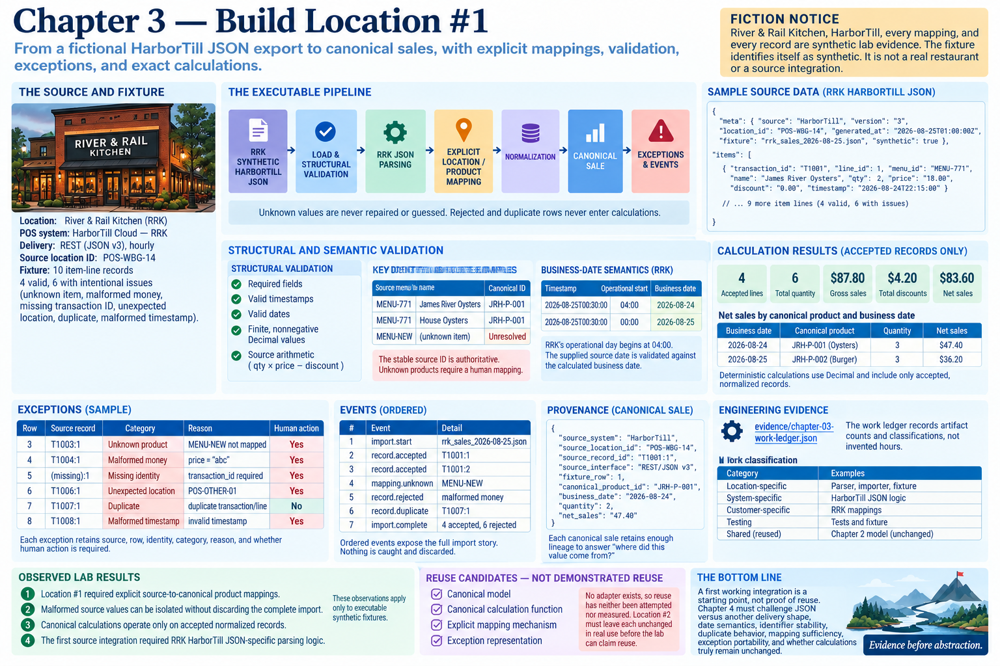

# Chapter 3 — Build Location #1



> **Fiction notice:** River & Rail Kitchen, HarborTill, every mapping, and every record are synthetic lab evidence. The fixture identifies itself as synthetic.

## The source and fixture

Location #1 remains **River & Rail Kitchen (`RRK`)**, not a more convenient replacement. Discovery established its primary sales source as fictional **HarborTill Cloud — RRK**, delivered hourly through REST with a JSON v3 shape. Accordingly, this chapter uses a compact JSON response fixture rather than CSV. Its ten item-line records use RRK's established `POS-WBG-14` location identity and location-local menu IDs. Four records are valid; the others demonstrate an unknown item, malformed money, missing transaction identity, an unexpected location, a repeated transaction/line identity, and a malformed timestamp.

## The executable pipeline

Run `python -m restaurant_integration_lab location1`. `LocationOneHarborTillJsonParser` loads the explicitly synthetic JSON envelope, validates its known fields, and creates a source record. `LocationOneSalesImporter` then resolves location and product identities, validates RRK's operational date, normalizes accepted records into Chapter 2 `Sale` objects, and retains exceptions and structured events. `calculate_sales` receives only canonical sales.

```text
RRK SYNTHETIC HARBORTILL JSON
  → load → structural validation → RRK JSON parsing
  → explicit location/product mapping → normalization
  → canonical Sale → exact calculations → exceptions/events
```

Structural validation covers required values, timestamps, dates, finite nonnegative `Decimal` values, and the source arithmetic relationship. Mapping/semantic validation separately rejects unknown locations, unknown products, a supplied business date inconsistent with RRK's rule, and duplicates. Unknown values are never repaired or guessed.

## Identity, operational dates, and idempotency

The source ID `MENU-771` resolves to canonical `JRH-P-001` even when the source display name changes from “James River Oysters” to “House Oysters”; the stable source ID is authoritative. `MENU-NEW` remains an actionable exception. Location identity likewise requires the exact source namespace and `POS-WBG-14` mapping.

RRK's explicit lab rule starts an operational day at 04:00. Thus `2026-08-25T00:30:00` deterministically belongs to business date `2026-08-24`; the supplied source date is checked against that calculation. The unique record identity is `transaction_id:line_id`. A set detects the fixture's duplicate within one run and retains accepted identities on the importer instance, so processing the fixture again emits no additional canonical sales. This is in-memory evidence, not persistence.

## Exceptions, events, calculations, and provenance

Each exception records source, row, source-record identity, category, reason, and whether human action is required. Ordered events expose import start/completion, acceptance, rejection, unknown mappings, and duplicates. Nothing is caught and discarded.

The four accepted lines total quantity `6`, gross sales `$87.80`, discounts `$4.20`, and net sales `$83.60`, using `Decimal`. Deterministic breakdowns group net sales by canonical product and business date. Rejected and duplicate rows never enter those calculations. Every canonical sale retains HarborTill, `POS-WBG-14`, transaction/line identity, interface, and fixture-row provenance.

## Engineering evidence and the reuse baseline

The machine-readable [work ledger](../evidence/chapter-03-work-ledger.json) records artifact counts and classifications, not invented hours. The parser, importer, source transformation, cutoff configuration, and fixture remain **LOCATION-SPECIFIC / SYSTEM-SPECIFIC WORK**. Chapter 2's model is reused unchanged as existing shared infrastructure; RRK mappings are customer-specific configuration; tests and fixture are testing evidence.

**REUSE CANDIDATES — NOT DEMONSTRATED REUSE:** the canonical model, canonical calculation function, explicit mapping mechanism, and exception representation. Location #2 must leave each unchanged in real use before the lab can claim reuse. With only one implemented source, similarity or intended use is not cross-location evidence.

## Observed lab results

- **OBSERVED LAB RESULT:** Location #1 required explicit source-to-canonical product mappings.
- **OBSERVED LAB RESULT:** Malformed source values can be isolated without discarding the complete import.
- **OBSERVED LAB RESULT:** Canonical calculations operate only on accepted normalized records.
- **OBSERVED LAB RESULT:** The first source integration required RRK HarborTill JSON-specific parsing logic.

Chapter 4 must challenge JSON versus another delivery shape, date syntax and business-day semantics, location/product identifier stability, duplicate behavior, mapping sufficiency, exception portability, and whether calculations truly remain unchanged. It must not assume those candidates survived merely because Chapter 3 named them.
