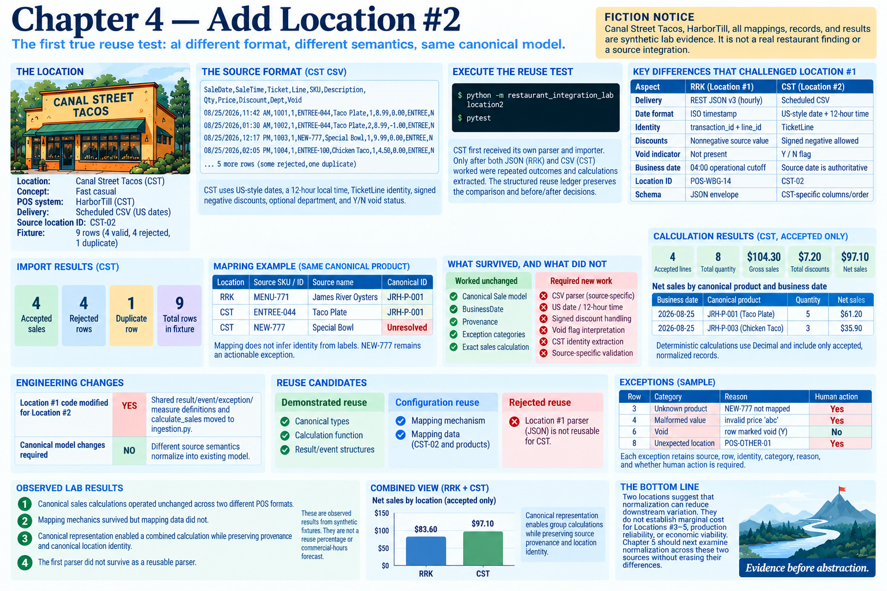

# Chapter 4 — Add Location #2



> **Fiction notice:** Canal Street Tacos, HarborTill, all mappings, records, and results are synthetic lab evidence.

## Execute the reuse test

```bash
python -m restaurant_integration_lab location2
pytest
```

Location #2 is the first true reuse test because Chapter 3 had only one implementation. Following the experiment rule, CST first received its own parser and importer. Only after the JSON and CSV implementations both worked were repeated ingestion outcomes and calculations extracted. The structured [reuse ledger](../evidence/chapter-04-reuse-ledger.json) preserves the comparison and before/after decisions.

## Differences that challenged Location #1

Discovery established CST as a scheduled CSV with US-style dates, not RRK's REST JSON v3. The synthetic fixture preserves that distinction and adds CST-specific column names/order, a 12-hour local time, `TicketLine` identity, `CST-02`, location-local SKUs, optional department, signed-negative discounts, and `Y`/`N` void status. CST's supplied `SaleDate` is authoritative; the 01:30 sale remains August 25 instead of receiving RRK's 04:00 cutoff. Nine rows yield four accepted sales, four rejected rows, and one duplicate.

These facts break assumptions that a vendor family supplies one schema, discounts are nonnegative source values, identity is always transaction plus line columns, and RRK's business-date rule transfers. The CSV parser remains source-specific rather than becoming an elaborate configurable parser.

## What survived, and what did not

The existing canonical `Sale`, `BusinessDate`, `Provenance`, location/product resolution functions, exception categories, and exact sales calculation all work for CST. `ENTREE-044` and RRK's `MENU-771` explicitly map to the same `JRH-P-001`; the mapping does not infer identity from their labels. `NEW-777` remains unresolved.

Mapping is **CONFIGURATION REUSE**, not unchanged data: CST adds `CST-02 → JRH-002` and three product records. Loading CSV, parsing dates/times, interpreting signed discounts and void flags, extracting identity, and accepting the source business date require a **SOURCE-SPECIFIC IMPLEMENTATION**.

**LOCATION #1 CODE MODIFIED FOR LOCATION #2: YES.** Its source parser and behavior were not changed. After repetition was visible, shared result/event/exception/measure definitions and `calculate_sales` moved to `ingestion.py`, and Location #1 imports them. This makes the cost visible rather than claiming the original module needed no work.

**CANONICAL MODEL CHANGES REQUIRED: NO.** CST supplies different source semantics, but they normalize honestly into the existing model. Adding signed-discount or void fields to `Sale` would leak source detail into the canonical layer.

## Demonstrated and rejected candidates

Canonical types and calculations are **DEMONSTRATED REUSE**: the same artifacts process accepted canonical records from both sources, including a deterministic net-sales-by-location proof. The explicit mapping mechanism is demonstrated configuration reuse. Repeated ingestion outcome structures justified a narrow extraction.

The Location #1 parser is a **REJECTED REUSE CANDIDATE**. Its JSON envelope, ISO timestamp, separate transaction/line identity, positive discount, and cutoff validation do not describe CST. Limited, visible parser duplication is preferable to configuration that obscures those semantic differences.

## Observed result and boundary

**OBSERVED LAB RESULT:** canonical sales calculations operated unchanged across two different POS formats. **OBSERVED LAB RESULT:** mapping mechanics survived but mapping data did not. **OBSERVED LAB RESULT:** canonical representation enabled a combined calculation while preserving provenance and canonical location identity. **OBSERVED LAB RESULT:** the first parser did not survive as a reusable parser.

These raw artifact counts are synthetic structural evidence, not a reuse percentage or commercial-hours forecast. Two locations suggest that normalization can reduce downstream variation; they do not establish marginal cost for Locations #3–5, production reliability, or economic viability. Chapter 5 remains unimplemented and should next examine normalization across these two concrete sources without erasing their differences.
