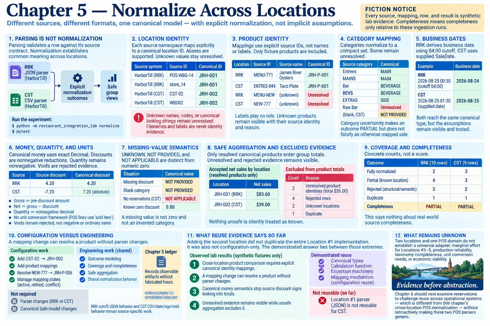

# Chapter 5 — Normalize Across Locations



> **Fiction notice:** Every source, mapping, row, and result is synthetic lab evidence. Completeness means completeness only relative to these ingestion runs.

## 1. Parsing is not normalization

The RRK JSON and CST CSV parsers establish that a row follows its source contract. That does not establish that its store, product, category, day, discount sign, or missing values mean the same thing. Chapter 5 therefore leaves both parsers explicit and adds a visible boundary:

```text
RRK JSON parser ─┐
                 ├─> explicit normalization outcomes ─> safe group views
CST CSV parser ──┘
```

Run it with `python -m restaurant_integration_lab normalize`. Run `pytest` for the mapping, semantic, coverage, and exclusion experiments.

## 2. Location identity

The inspectable mappings in `normalization.py` connect each source namespace and identifier to `JRH-001` or `JRH-002`. They also demonstrate the requested `store_14 → JRH-001` and `WBG02 → JRH-002` aliases. An unknown restaurant name, source code, or canonical-looking string stays unresolved; filenames and labels are never identity evidence.

## 3. Product identity

The compact catalog covers only fixture products. RRK `MENU-771` and CST `ENTREE-044` explicitly converge on `JRH-P-001`; labels play no role. `MENU-NEW` and `NEW-777` remain unresolved in the ordinary run. The outcome records their source identity and reason rather than returning a hidden `None`. No fuzzy matching exists.

## 4. Category mapping

`Entrees` and `MAINS` map to `MAIN`; `Bar` and `BEVS` map to `BEVERAGE`; `EXTRAS` maps to `SIDE`. `Raw Bar` deliberately remains unresolved because this evidence does not justify guessing. CST's blank department is `NOT PROVIDED`, not zero and not an invented category. Category uncertainty makes an outcome `PARTIAL` but does not falsify an otherwise mapped sale.

## 5. Business dates

RRK derives and validates `BusinessDate` using its explicit 04:00 cutoff. CST treats its supplied `SaleDate` as authoritative. Thus the after-midnight RRK line belongs to August 24 while the 01:30 CST line belongs to August 25. Both reach the same canonical type, but the assumptions remain visible and tested rather than hidden in a generic parser.

## 6. Money, quantity, and units

Canonical money uses exact `Decimal`: gross is the pre-discount amount, discount is a nonnegative reduction, and net equals gross minus discount. RRK's positive discount enters unchanged; CST's negative sign is explicitly inverted. Quantity remains the nonnegative decimal sale-line quantity demonstrated by the fixtures. Voids stay rejected source evidence rather than negative or ordinary sales. POS lines currently have no distinct unit field, so they share the narrow semantic unit “sold item”; no inventory conversion framework is introduced. Incompatible units remain prohibited by Chapter 2.

## 7. Missing-value semantics

The compact states `UNKNOWN`, `NOT PROVIDED`, and `NOT APPLICABLE` remain distinct from numeric zero. A missing discount returns `NOT PROVIDED`; it becomes zero only when the source supplied an exact zero under its contract. A blank category similarly remains `NOT PROVIDED`.

## 8. Safe aggregation and excluded evidence

The deterministic in-memory dataset groups accepted canonical money by location, product, and business date. Product totals include only resolved canonical products. The two unknown-product rows are separately countable and retain their source record IDs and reason. Structural failures, unknown locations, categories, voids, and duplicates also remain inspectable. Nothing unsafe is silently treated as known.

The fixture's accepted net sales are `$83.60` for `JRH-001` and `$39.00` for `JRH-002`. Product comparison excludes two records specifically because their product identities are unresolved; it does not silently add their `$26.00` under labels.

## 9. Coverage and completeness

Coverage reports concrete counts, not a score. RRK reads 10 rows: 2 fully normalized, 4 partial (two unresolved categories, one product, one location), 3 structurally/semantically rejected, and 1 duplicate. CST reads 9 rows: 3 fully normalized, 3 partial (one missing category, one product, one location), 2 structurally/semantically rejected, and 1 duplicate. Both are `PARTIAL` for canonical product comparison. This says nothing about real-world source completeness.

## 10. Configuration versus engineering

The executable mapping-change experiment first marks `NEW-777` as `EXPLICITLY UNMAPPED`, then adds one `ProductMapping` and resolves it to `JRH-P-006`. The resolver also has visible conflict and retired/legacy states. Neither source parser changes. That is configuration work. Outcome modeling, coverage, completeness, and safe views are new shared engineering work. RRK cutoff/JSON behavior and CST CSV/date/sign/void behavior remain source-specific work.

The [Chapter 5 ledger](../evidence/chapter-05-normalization-ledger.json) records observable artifacts without fabricated hours. Chapter 5 required no rework of the parsers or canonical `Sale` model.

## 11. What reuse evidence says so far

Adding the second location did **not** duplicate the entire Location #1 implementation: canonical records, calculations, mappings, and exception machinery survived. It was also **not configuration-only**: Chapter 4 required a CST parser and Chapter 5 required genuinely shared cross-location normalization behavior. The demonstrated answer lies between those extremes.

Observed only in this lab:

- **OBSERVED LAB RESULT:** Cross-location product comparison requires explicit canonical identity mappings.
- **OBSERVED LAB RESULT:** A mapping change can resolve a product without parser changes.
- **OBSERVED LAB RESULT:** Canonical money semantics stop source discount signs leaking into totals.
- **OBSERVED LAB RESULT:** Unresolved evidence remains visible while unsafe aggregation excludes it.

## 12. What remains unknown

Two locations and one POS domain do not establish a universal adapter, marginal effort for Locations #3–5, production reliability, taxonomy completeness, unit conversion needs, or economic viability. Chapter 6 remains unimplemented. Introducing reservations should challenge reuse across operational systems—which is different from this chapter's cross-location POS normalization—without retroactively making these two POS parsers generic.
