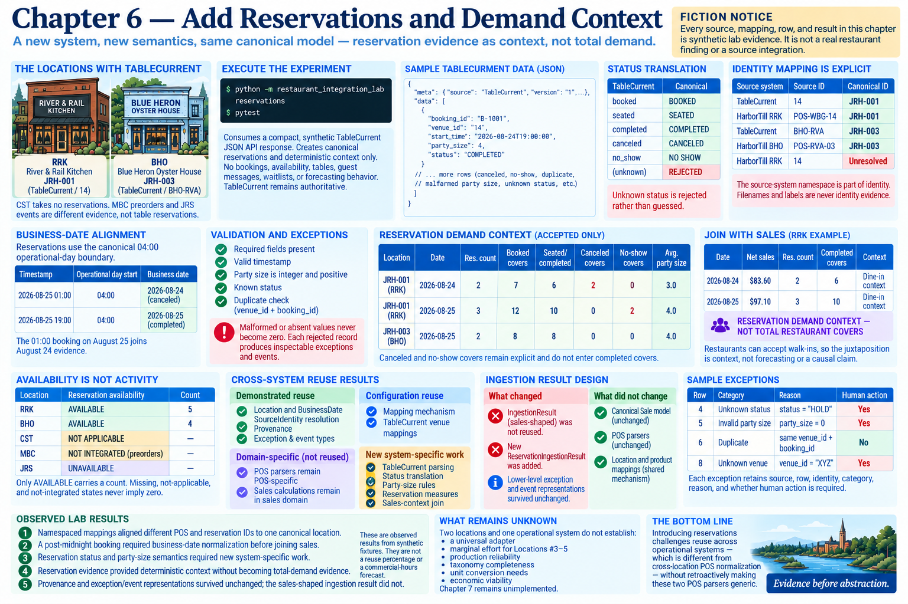

# Chapter 6 — Add Reservations and Demand Context



## Execute the experiment

```bash
python -m restaurant_integration_lab reservations
pytest
```

The command consumes a compact, explicitly synthetic TableCurrent JSON API response. It does not create or modify bookings. The boundary stops at canonical reservations and deterministic context; TableCurrent remains authoritative. No booking, availability, table, guest-message, waitlist, or forecasting behavior exists here.

## Adding a system is not adding a location

Chapters 3–5 translated variations in one POS domain. TableCurrent introduces venue-local booking identity, reservation timestamps, covers, cancellations, and no-shows. A JSON transport does not make its semantics equivalent to HarborTill JSON. Therefore `TableCurrentParser` is source-specific and POS parsers remain POS-specific.

Discovery says River & Rail Kitchen (RRK) and Blue Heron Oyster House (BHO) use TableCurrent. Canal Street Tacos takes no reservations. Manchester Bake & Coffee preorders and James River Smokehouse events are different evidence, not table reservations. This chapter integrates only RRK and BHO and preserves those differences.

## Identity and time alignment

Explicit mappings resolve `TableCurrent / 14` and `HarborTill RRK / POS-WBG-14` to `JRH-001`. The source-system namespace is part of identity: `HarborTill RRK / 14` remains unresolved. BHO's `TableCurrent / BHO-RVA` resolves to `JRH-003`.

Reservations use the canonical 04:00 operational-day boundary. The fixture's canceled booking at 01:00 on August 25 therefore joins August 24 evidence. Joins use canonical `(Location, BusinessDate)`, never raw timestamps.

## Statuses and validation

TableCurrent terms are explicitly translated to `BOOKED`, `SEATED`, `COMPLETED`, `CANCELED`, and `NO SHOW`. Unknown status is rejected rather than guessed. Party size is required, integer, and positive; malformed or absent values never become zero. Venue-local duplicate identity uses `(venue_id, booking_id)`.

The synthetic fixture deliberately includes accepted bookings at two venues plus a cancellation, no-show, duplicate, malformed party size, unknown status, unknown venue, and malformed timestamp. Each rejected record produces the same inspectable exception/event structures used by POS ingestion.

## Reservation demand context—not total demand

For each canonical location/business date the implementation calculates reservation count, booked covers, seated/completed covers, canceled covers, no-show covers, and average valid party size. Canceled and no-show covers remain explicit and do not enter completed covers.

The RRK measure joins to canonical net sales for the same location/date. This juxtaposition is context, not forecasting or a causal claim. Restaurants can accept walk-ins, so the code and report label the result **RESERVATION DEMAND CONTEXT — NOT TOTAL RESTAURANT COVERS**.

## Availability is not activity

The report distinguishes TableCurrent records available for RRK/BHO, reservations not applicable for CST, table reservations not integrated for MBC, and unavailable evidence for JRS. Only `AVAILABLE` carries a count. Missing, not-applicable, and not-integrated states never imply zero.

## Cross-system exceptions and reuse result

### Demonstrated cross-system reuse

Canonical `Location` and `BusinessDate`, namespaced `SourceIdentity` resolution, `Provenance`, `IngestionException`, and `IngestionEvent` execute unchanged for POS and reservations.

### Domain-specific reuse

POS parsers and sales calculations remain inside the sales/POS domain. They were not promoted into generic CSV or JSON frameworks.

### Configuration reuse

The explicit mapping mechanism survives, with new TableCurrent venue mappings. Shared mechanism does not mean shared identifiers.

### New system-specific work

TableCurrent parsing, status translation, party-size rules, duplicate semantics, reservation measures, availability configuration, and the sales-context join are reservation-specific.

### Rework / honest abstraction result

The existing `IngestionResult` contains `sales` and `SalesMeasures`; it was shared across POS locations, not across operational systems. Rather than force reservations into that sales abstraction, Chapter 6 adds `ReservationIngestionResult`. The lower-level exception and event representations survived. Thus the shared infrastructure survived only in part—which is useful evidence against treating cross-location reuse as proof of cross-system reuse.

## Observed lab results

- Namespaced mappings aligned different POS and reservation IDs to one canonical location.
- A post-midnight booking required business-date normalization before joining sales.
- Reservation status and party-size semantics required new system-specific work.
- Reservation evidence provided deterministic context without becoming total-demand evidence.
- Provenance and exception/event representations survived unchanged; the sales-shaped ingestion result did not.

No engineering hours are asserted. Chapter 7 labor integration is intentionally absent; it should next challenge whether a third system can relate through canonical location/business date without erasing labor-specific meaning.
