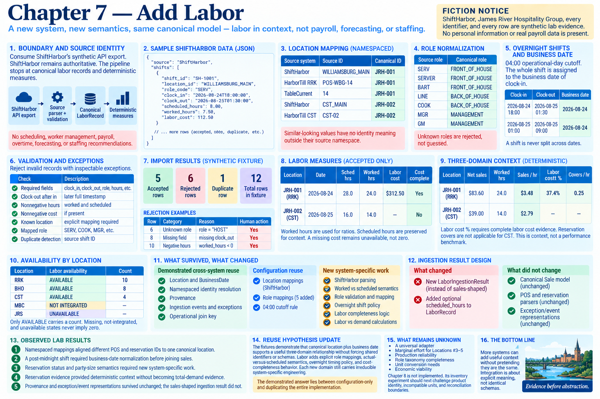

# Chapter 7 — Add Labor



> **Fiction notice:** ShiftHarbor, James River Hospitality Group, every identifier, and every row are synthetic lab evidence. No personal information or real payroll data is present.

## Boundary and source identity

Chapter 1 discovered the fictional group-wide **ShiftHarbor labor API**. Chapter 7 consumes a compact synthetic API JSON export; ShiftHarbor remains authoritative. The executable path is export → source parser → validation → explicit location/role/date normalization → canonical `LaborRecord` → deterministic measures. It does not create schedules, manage workers, calculate payroll or overtime, forecast labor, or recommend staffing.

The source contains only synthetic worker IDs. Canonical records retain the source shift ID and namespaced source location through `Provenance`; they do not create employee master data. `ShiftHarbor / WILLIAMSBURG_MAIN`, `HarborTill RRK / POS-WBG-14`, and `TableCurrent / 14` independently map to `JRH-001`. Similar-looking values have no identity meaning outside their source namespace.

Run the executable artifact:

```bash
python -m restaurant_integration_lab labor
```

## Scheduled versus actual evidence

The fixture supports both scheduled and actual worked hours. `scheduled_hours` is preserved separately; canonical `LaborRecord.hours` means **worked hours**, as Chapter 2 originally defined it. Labor measures, cost ratios, and demand ratios use actual worked hours. Scheduled hours remain visible for context and are never substituted for worked hours.

This is labor evidence, not payroll. Labor cost is consumed exactly as exported using `Decimal`; no wage is inferred from a role. A present `0.00` would remain zero, while `null` remains unavailable.

## Location and role normalization

The explicit namespaced mapping mechanism used by other domains survives unchanged. Two new location mapping records are configuration. Roles introduce a labor-specific mapping dimension: `SERV` and `SERVER` can both become `FRONT_OF_HOUSE`, but only through explicit location/code mappings. The fixture supports only `FRONT_OF_HOUSE`, `BACK_OF_HOUSE`, and `MANAGEMENT`. Unknown roles are rejected for review rather than guessed; this is not a universal job taxonomy.

## Overnight shifts and business date

The established 04:00 operational-day cutoff is reused. The explicit policy assigns the **whole shift** to the business date derived from clock-in; it never splits a shift. Thus the 18:00–01:30 overnight shift belongs to `2026-08-24`. A clock-in at 01:00 also belongs to the previous calendar date. Clock-out must be a later full timestamp: an unexplained reversal is rejected rather than silently treated as overnight.

## Validation and inspectable exceptions

The importer rejects missing required fields (including clock-out), malformed or negative hours, impossible negative cost, unknown locations, and unmapped roles. Duplicate detection uses ShiftHarbor's source shift ID and reports the duplicate separately. The accepted fixture remains the majority: five accepted rows, six rejected rows, and one duplicate.

## Canonical measures and the three-domain join

Accepted records produce scheduled hours, worked hours, cost completeness, cost where complete, and hours by canonical role for each `canonical location + business date`. The context joins that key to accepted HarborTill sales and, where present, TableCurrent completed/seated reservation covers. It calculates net sales per worked hour, labor cost percentage only when every accepted labor row has cost, and completed reservation covers per worked hour only where reservation evidence exists.

The CLI presents a deterministic two-location comparison. These ratios are **investigation signals and comparison context**, not evidence that either restaurant is overstaffed or understaffed. Reservation covers exclude walk-ins, and the tiny synthetic fixture is not a performance benchmark.

At `JRH-002`, one accepted shift has no cost, so aggregate cost and labor-cost percentage are unavailable—not zero. Reservation evidence is not applicable there, so covers ratios are also unavailable. Evidence availability is calculation behavior rather than a footnote.

## What survived, what changed

**Demonstrated cross-system reuse:** `Location`, `BusinessDate`, namespaced identity resolution, provenance, ingestion events, inspectable exceptions, and—most importantly—the operational join key align POS, reservations, and labor without shared source IDs.

**Configuration reuse:** the location mapping mechanism survives with two ShiftHarbor mappings; five role mappings and the 04:00 rule are explicit configuration evidence.

**System-specific work:** ShiftHarbor parsing, worked/scheduled meanings, role semantics, shift validation, whole-shift business-date policy, labor completeness, aggregation, and labor-versus-demand calculations.

**Rework:** `LaborRecord` gained optional `scheduled_hours` because its earlier single `hours` field could preserve worked evidence but not both evidence types explicitly.

**Rejected reuse candidate:** POS and reservation ingestion result shapes remain domain-specific. Labor receives its own result rather than pretending sale lines, bookings, and shifts share semantics.

The evidence ledger records structural facts and deliberately records `engineering_hours: null`; no engineering time is invented.

## Observed lab results and the reuse hypothesis

The executable fixtures demonstrate that canonical location plus business date supports a useful three-domain relationship without forcing shared identifiers or schemas. They also demonstrate that labor adds explicit role mappings, actual-versus-scheduled semantics, overnight timing policy, and cost-completeness behavior. Missing labor cost safely prevents a percentage. These results strengthen the narrow shared-join hypothesis while showing that each new domain still carries irreducible system-specific engineering.

Chapter 8 is not implemented. Its inventory experiment should next challenge product identity, incompatible units, incomplete evidence, and reconciliation boundaries—relationships less clean than the location/date labor join.
