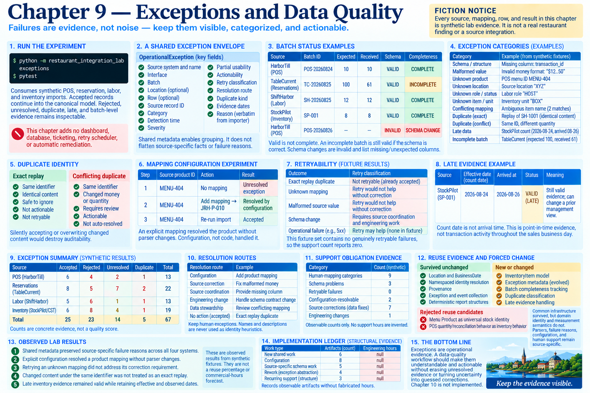

# Chapter 9 — Exceptions and Data Quality



## Run the experiment

```bash
python -m restaurant_integration_lab exceptions
pytest
```

The command uses synthetic POS, reservation, labor, and inventory imports. Failures are operational evidence: accepted records continue into the canonical model while rejected, unresolved, duplicate, late, and batch-level evidence remains inspectable. This chapter adds no dashboard, database, ticketing, retry scheduler, or automatic remediation.

## One shared envelope, source-specific facts

`OperationalException` supplies source system and name, interface, batch, optional location and row, source record ID, category, detection time, severity, partial usability, actionability, retry classification, resolution route, duplicate kind, and evidence dates. It retains the existing importer's reason verbatim. Shared metadata enables grouping; it does not flatten “malformed party size,” “unknown role,” or “missing product-specific pack conversion” into a meaningless generic error.

The original per-source importers still own parsing and semantic validation. Chapter 9 evolves their existing `IngestionException` boundary rather than creating replacement parsers.

## Batch status: valid is not complete

`IngestionBatchResult` records source, interface, batch ID, effective date, read/accepted/rejected/duplicate/unresolved counts, schema status, completeness status, and exceptions. Counts are transparent rather than collapsed into a quality score.

The reservation partial-file fixture explicitly says 100 records were expected and 61 arrived. Its schema is `VALID` and completeness is `INCOMPLETE`. No completeness inference is invented. Conversely, the schema-change batch is `INVALID`: the fixture renames `transaction_id` to `check_number`, and validation lists missing and unexpected columns instead of guessing equivalence.

## Structural and semantic failures

Structural failures include changed schemas, absent required identifiers, and malformed values. Existing POS evidence includes a blank transaction ID; it remains rejected and no synthetic identity is generated. Semantic failures include unknown products, statuses, roles, locations, inventory items, units, conversions, and conflicting mappings. The shared model preserves those distinctions and their original reasons.

## Duplicate identity

Duplicates are compared by a deterministic content fingerprint. The same identifier and identical content is an `EXACT REPLAY`, safely non-actionable. The same identifier with changed money or quantity is a `CONFLICTING DUPLICATE`, categorized as a conflicting identifier and requiring investigation. Silently accepting or overwriting the changed record would destroy auditability.

Mapping configuration has the same immutable-identity rule. `MappingRegistry.add` is idempotent for the same mapping but rejects an attempt to remap one source product ID to another canonical product.

## Late and incomplete evidence

The StockPilot `SP-001` count remains valid inventory evidence with effective date 2026-08-24 and arrival date 2026-08-26. Late does not mean invalid, but it can change a previously produced management view. This is different from the explicitly incomplete reservation batch, and both differ from an invalid schema.

## Keep human exceptions

Unknown product, location, role/status, item/unit, incompatible conversion, and conflicting identity outcomes cross an explicit human boundary. Names and descriptions are never used as identity heuristics. Severity is deterministic but independent of actionability: a warning may still require review.

The configuration experiment begins with an open `MENU-404` product mapping, adds an explicit source-to-canonical mapping, then marks the exception `RESOLVED BY CONFIGURATION`; parser code does not change. The source-correction experiment keeps malformed money open because configuration cannot make malformed source evidence trustworthy. A schema contract change may require source coordination and engineering work.

## Retryability

Chapter 9 classifies outcomes but schedules nothing. Exact replay is not retryable because it is already accepted. Unknown mappings and malformed records say `RETRY WOULD NOT HELP WITHOUT CORRECTION`. The model can represent a genuinely retryable operational failure, but this deterministic fixture set contains none; the support count therefore reports zero instead of inventing one.

## Reporting and support evidence

The report groups actual exceptions by system and category, lists batch measures, and separates human action, configuration resolution, source correction, schema change, duplicate conflict, late data, and incomplete batches. Support-obligation evidence exposes observable counts: human-mapping categories, schema problems, retryable failures, configuration-resolvable exceptions, source corrections, and code-change evidence. It deliberately reports no hours.

The implementation ledger separates new shared work, configuration, source-specific schema work, recurring support, and rework to the earlier exception abstraction. These results qualify the original reuse hypothesis: common reporting metadata was reusable across four systems, while parsers, failure reasons, configuration, and human support remain source-specific delivery obligations. Chapter 10 should surface normalized evidence alongside its batch completeness, schema state, late evidence, and unresolved exceptions rather than hiding them.

## Observed lab results

* **OBSERVED LAB RESULT:** Shared metadata preserved source-specific failure reasons across all four systems.
* **OBSERVED LAB RESULT:** Explicit configuration resolved a product mapping without parser changes.
* **OBSERVED LAB RESULT:** Retrying an unknown mapping did not address its correction requirement.
* **OBSERVED LAB RESULT:** Changed content under the same identifier was not treated as an exact replay.
* **OBSERVED LAB RESULT:** Late inventory evidence remained valid while retaining effective and observed dates.
