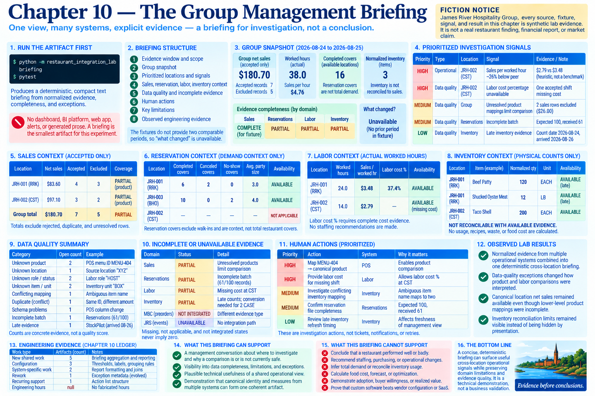

# Chapter 10 — The Group Management Briefing



> **Fiction notice:** James River Hospitality Group, every source, fixture, signal, and result is synthetic lab evidence. This chapter is not a claim about a real restaurant group or market.

## Run the artifact first

```bash
python -m restaurant_integration_lab briefing
pytest
```

The command produces a deterministic, compact text briefing. A briefing is the smallest artifact capable of testing the management-usefulness question. A dashboard, BI platform, web application, alert engine, or generated prose would add product surface without improving this experiment's evidence. The implementation therefore consumes **normalized operational evidence + explicit completeness + exceptions**, never raw source fixture fields.

## Questions and structure

Chapter 1 scoped management interest to cross-location sales, labor relative to demand, inventory and waste anomalies, evidence gaps, and exceptions. Chapter 10 asks only: which available location measures differ, where should a human investigate, which evidence is incomplete, which comparisons are unsafe, and which mappings or systems limit interpretation? It does not invent a broader analytics product.

The output has an evidence window, group snapshot, prioritized locations/signals, cross-location sales, reservation, labor, and inventory context, data quality, incomplete evidence, human actions, limitations, and observed engineering evidence. The fixtures do not provide two comparable group periods, so “what changed” says unavailable instead of fabricating history.

## Transparent investigation signals

Signals are divided into **OPERATIONAL INVESTIGATION** and **DATA QUALITY INVESTIGATION**. The operational fixture rule surfaces a location whose sales per worked hour is at least 25% below the available fixture peer. This is explicitly a synthetic comparison heuristic—not an industry benchmark, severity claim, or staffing recommendation.

Data-quality rules surface unresolved identity blocking product comparison, missing labor cost omitting the cost percentage, invalid schemas, incomplete batches, and inventory that cannot be reconciled. `HIGH`, `MEDIUM`, and `LOW` provide stable sorting under documented lab rules; they are not alerts, probabilities, confidence scores, or universal business severity. Every signal prints its evidence and limit.

## Completeness and safe aggregation

Evidence states use `COMPLETE FOR FIXTURE`, `PARTIAL`, `UNAVAILABLE`, `NOT APPLICABLE`, and `BLOCKED BY UNRESOLVED MAPPING`. They do not turn missing evidence into zero. Group net sales sums accepted canonical sales only, because both adapters have already normalized money, location, and business-date semantics. Accepted and excluded counts remain beside that total.

Product comparison is less safe: unresolved product/location rows block affected detail. The executable scenario demonstrates the distinction. Both locations retain canonical net-sales totals from accepted rows, while `PRODUCT COMPARISON LIMITED` prevents a conclusion from incomplete product evidence. Thus incomplete detail does not invalidate every compatible higher-level measure, but the total also never includes amounts from rejected rows.

## Domain context, not conclusions

**Sales** shows canonical net sales, accepted records, exclusions, and coverage. It is operational comparison context, not financial reporting.

**Reservations** shows completed/seated covers plus cancellation and no-show context only where available. CST remains `NOT APPLICABLE`. Reservation covers are explicitly not total restaurant covers and do not establish total demand.

**Labor** shows worked hours and sales per worked hour. Labor-cost percentage appears only when all required accepted cost evidence exists; otherwise it is omitted. The briefing makes no staffing recommendation and applies no industry labor benchmark.

**Inventory** prints only safely normalized item/unit quantities, preserves late evidence, and repeats `NOT RECONCILABLE WITH AVAILABLE EVIDENCE`. Counts do not establish usage, recipes, theoretical inventory, waste, or food cost.

## Exceptions and human support

Chapter 9 is first-class input. The briefing counts open human-action exceptions, configuration-resolvable mappings, source-correction issues, schema issues, conflicting duplicates, late evidence, and incomplete batches, then displays a bounded action list. This makes it possible to see when an apparent operational difference may instead be constrained by evidence quality. It creates no ticket, notification, automatic correction, retry, or alert.

The [Chapter 10 ledger](../evidence/chapter-10-briefing-ledger.json) records demonstrated shared value, new shared work, system-specific contributions, support obligations, and rework. It records no fabricated engineering hours.

## What the briefing can and cannot support

The briefing can support a management conversation about where to investigate and why a comparison is or is not currently safe. It demonstrates technically that canonical identity and measures from multiple synthetic systems can form one coherent artifact while preserving domain limitations and source exceptions.

It cannot conclude that a restaurant performed well or badly, recommend staffing, infer total demand, reconcile inventory usage, calculate food cost, forecast, issue alerts, or act as financial reporting. It also cannot demonstrate adoption, buyer willingness, realized value, willingness to pay the modeled `$42,000`, or that custom software beats vendor configuration or SaaS. Plausible technical usefulness and market validation remain different evidence categories.

## Observed lab results

* **OBSERVED LAB RESULT:** Normalized evidence from multiple operational systems combined into one deterministic cross-location briefing.
* **OBSERVED LAB RESULT:** Data-quality exceptions changed how product and labor comparisons were interpreted.
* **OBSERVED LAB RESULT:** Canonical location net sales remained available even though lower-level product mappings were incomplete.
* **OBSERVED LAB RESULT:** Inventory reconciliation limits remained visible instead of being hidden by presentation.

Chapter 11 is intentionally absent. Its next challenge is whether this useful lab integration can operate reliably with configuration and credentials, scheduled and idempotent ingestion, retry behavior, observability, failure recovery, security boundaries, and deployment documentation—without pretending this lab is already a production restaurant platform.
