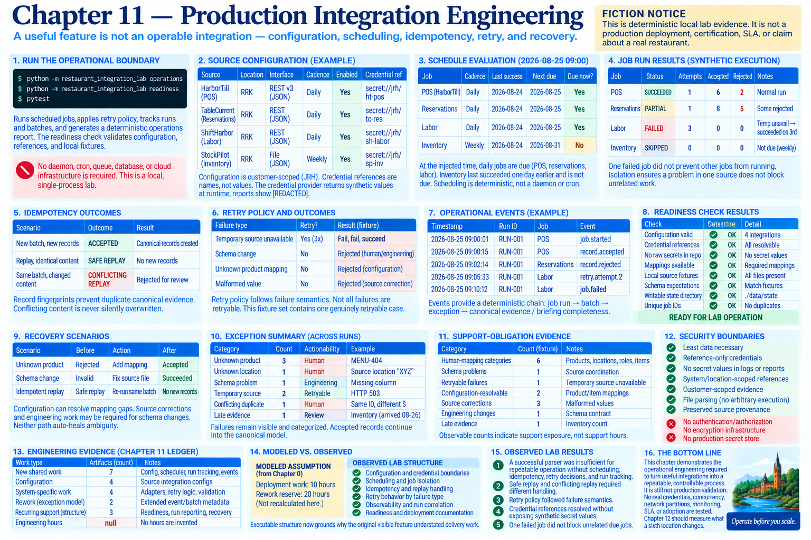

# Chapter 11 — Production Integration Engineering



> **Fiction notice:** This is deterministic local lab evidence. It is not a production deployment, certification, SLA, or claim about a real restaurant.

## Run the operational boundary first

```bash
python -m restaurant_integration_lab operations
python -m restaurant_integration_lab readiness
pytest
```

A useful feature is not the same thing as an operable integration. Chapters 3–10 reached a management briefing when invoked manually; this chapter places typed configuration, credential references, deterministic scheduling, idempotency, retry decisions, run identity, structured evidence, and recovery around the same domain boundary. It does not redesign the canonical restaurant model.

## Configuration, customer scope, and credential boundary

The production-like JSON fixture declares four source integrations. Every entry names James River Hospitality Group (`JRH`), source and optional canonical location, interface, enabled state, daily or weekly cadence, input reference, expected schema, retry policy, and a scoped `secret://` reference. It contains no credential values. The typed loader prevents future reuse from silently mixing customer evidence.

`SourceConfiguration.credential_ref` passes to a `CredentialProvider`; the fake provider returns synthetic runtime values only inside the lab. Reports render `[REDACTED]`, never the value. This demonstrates a boundary, not a secret manager.

## Scheduling, run identity, and isolation

At the injected time `2026-08-25T09:00:00`, daily POS, reservations, and labor jobs are due; inventory last succeeded one day earlier and its weekly job is not due. There is no daemon or cron. Each execution records job, run, batch, source, location, effective period, start/completion time, counters, attempt, and status.

The executable isolation scenario retains `SUCCEEDED`, `PARTIAL`, `FAILED`, and `SKIPPED` per job. A labor failure does not prevent POS or reservations work. This is sequential deterministic isolation, not distributed processing.

## Record and batch idempotency

The in-memory state store fingerprints content. An already accepted source record does not create a second canonical evidence record, even in another batch. An identical replay of a known batch becomes `SAFE REPLAY`. The same batch identity with different content raises a `CONFLICTING REPLAY`; it is not silently overwritten. Customer ID participates in the operational boundary, and canonical evidence retains run, batch, and source-record correlation.

## Retry decisions and partial success

The explicit three-attempt policy retries `TEMPORARY SOURCE UNAVAILABLE`. The scenario fails twice and succeeds once, producing one canonical outcome. `SCHEMA CHANGE`, `UNKNOWN PRODUCT`, and `MALFORMED VALUE` do not retry because human, mapping, or source correction is required. This operationalizes Chapter 9's distinction between retryability and correction rather than retrying every failure.

A batch with accepted and rejected records remains `PARTIAL`. Usable evidence survives while its completeness impact remains inspectable; neither total success nor total failure hides it.

## Structured observability and correlation

`OperationalEvent` provides deterministic JSON fields for timestamp, run/job/batch, source/location, event/status, exception category, record counters, and attempt. It excludes source rows and credentials. The identifiers provide the modest chain **job run → batch → exception → canonical evidence / briefing completeness**, without claiming full tracing.

The operations report counts due, successful, partial and failed jobs, retries, human-action exceptions, and late sources, then prints last successes. It invents no uptime percentage or SLA.

## Recovery

The mapping recovery first accepts a known record and rejects an unresolved one. After an explicit mapping correction, replay in a corrected batch accepts the unresolved record while record idempotency prevents duplication of the earlier accepted evidence. The schema recovery replaces invalid source shape with corrected input and reruns successfully. Neither path auto-heals ambiguity.

## Security boundaries

The lab encodes least data necessary, reference-only committed credentials, no secret logging, system/location-scoped references, customer-scoped evidence, fixed data-file parsing rather than arbitrary execution, and preserved source provenance. It does not implement authentication, authorization, encryption infrastructure, or a production secret store.

## Local deployment and readiness

No Docker, cloud, queue, database, worker, or monitoring vendor is required. From the repository root, the configuration fixture and packaged source fixtures are the production-like deployment artifact. The readiness command checks configuration, resolvable references, raw-secret absence, mappings, local source availability, schema expectations, writable state, and unique job IDs. Warnings are allowed for a deliberately unavailable simulated source; failures yield `NOT READY FOR LAB OPERATION`. Passing checks yield `READY FOR LAB OPERATION`, never “production certified.”

## Support-obligation evidence

The structural ledger records four job types/integrations, four credential references, four retry classifications, four human-action categories, four compatible schemas, eight readiness checks, and two recovery paths. These are observable drivers of support exposure, not support-hour estimates.

## Modeled assumption versus observed structure

**MODELED ASSUMPTION:** deployment work remains **10 hours** and rework reserve remains **20 hours** from Chapter 0.

**OBSERVED LAB STRUCTURE:** operational engineering required configuration, credential boundaries, scheduling, idempotency, retry behavior, observability, recovery, and deployment/run documentation. No hours are recalculated here; Chapter 14 owns that later economic comparison. Executable structure now grounds why the original visible feature understated delivery work.

## Observed lab results

* **OBSERVED LAB RESULT:** A successful parser was insufficient for repeatable operation without scheduling, idempotency, retry decisions, and run tracking.
* **OBSERVED LAB RESULT:** Safe replay and conflicting replay required different handling.
* **OBSERVED LAB RESULT:** Retry policy followed failure semantics.
* **OBSERVED LAB RESULT:** Credential references resolved without exposing synthetic secret values.
* **OBSERVED LAB RESULT:** One failed job did not block unrelated due jobs.

## Why this is still not production validation

Everything is local, deterministic, single-process, and in memory. The chapter does not test real credentials, APIs, concurrency, durable state, clock behavior, network partitions, access controls, retention, alert delivery, recovery time, load, adoption, or on-call practice. It adds no sixth restaurant and performs no delivery-economic recalculation. Chapter 12 should use this boundary to measure what a sixth location changes as **worked unchanged, configuration only, new mappings, new code, new customer discovery, rework, and support exposure**.
