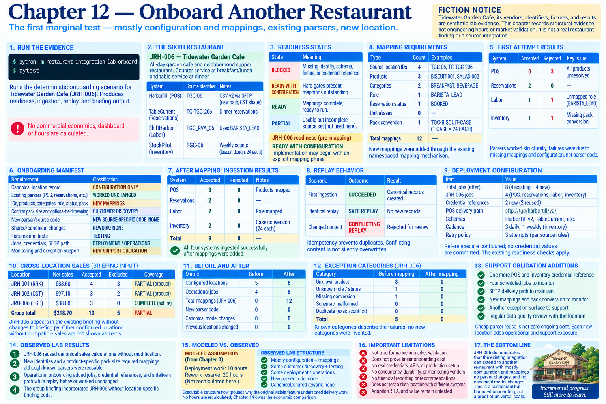

# Chapter 12 — Onboard Another Restaurant



> **Fiction notice:** Tidewater Garden Cafe, its vendors, identifiers, fixtures, and results are synthetic. This chapter records structural evidence, not engineering hours or market validation.

## Why this is the first marginal test

Chapter 4 compared a second POS implementation while shared infrastructure was still being discovered. JRH-006 arrives after canonical sales, reservations, labor, inventory, exceptions, briefing, and operational reliability exist. It therefore asks what changes at the margin rather than what the initial platform cost. Run the evidence with:

```bash
python -m restaurant_integration_lab onboard
pytest
```

The structured result is preserved in the [Chapter 12 ledger](../evidence/chapter-12-onboarding-ledger.json). No commercial economics or hours are calculated.

## The sixth restaurant and discovery

**JRH-006 — Tidewater Garden Cafe** is an all-day garden cafe and neighborhood supper restaurant: counter service at breakfast/lunch and table service at dinner. It uses a HarborTill scheduled CSV v2 delivered to a new SFTP path, the existing TableCurrent and ShiftHarbor APIs, and StockPilot weekly counts. Its source identifiers are `TGC-06`, `TC-TGC-206`, and `TGC_RVA_06`.

Discovery found plausible reuse, not uniformity. The HarborTill file has CST's known CSV shape but a newer export label and sometimes omits the optional department. Dinner reservations use a new venue ID. Labor introduces `BARISTA_LEAD`. Inventory counts biscuit dough by a product-specific 24-each case. New product and category identifiers are local. Discovery still had to confirm the case pack and must review HarborTill group sales and TableCurrent multi-venue pacing reports before assuming custom scope is necessary.

Management includes the location to compare canonical sales, labor relative to demand, inventory anomalies, evidence gaps, and exceptions. These questions are the collection boundary; onboarding is not an attempt to ingest every vendor field.

## Deterministic readiness

Readiness is **BLOCKED** when the canonical identity, known schema, required sample, or credential reference is absent. With those hard gates present but mappings outstanding it is **READY WITH CONFIGURATION**. It becomes **READY** only when mappings are declared complete. `PARTIAL` is reserved for a usable but incomplete source set; this compact onboarding does not manufacture that state from a score.

The recorded pre-mapping state is **READY WITH CONFIGURATION**. This means implementation may begin with an explicit mapping phase; it does not mean an operational run may bypass configuration.

## First attempt: failures before fixes

The first attempt added only identity and obvious source configuration. The existing CST-shaped POS parser accepted all three rows structurally, while all three product identities remained unresolved. The TableCurrent parser accepted the reservation shape. The ShiftHarbor parser accepted the labor shape but the new role required mapping. The StockPilot field/unit semantics were known, but case-to-each remained unsafe until discovery confirmed a product-specific pack conversion.

This exception was resolved through **NEW MAPPINGS**, not parser modification: `TGC-BISCUIT-CASE` receives only its own `1 CASE = 24 EACH` rule. Unknown product mappings similarly fail explicitly and then resolve through the existing namespaced mapping mechanism.

## Onboarding manifest and observed work

| Requirement | Classification |
|---|---|
| Canonical location record | CONFIGURATION ONLY |
| POS CSV, TableCurrent, ShiftHarbor, and StockPilot parsing semantics | WORKED UNCHANGED |
| Four source-location IDs; three products; two categories; one role; one status; one pack conversion | NEW MAPPINGS |
| Confirm pack size and optional-field meaning | CUSTOMER DISCOVERY |
| New parser/source validation/exception code | NEW SOURCE-SPECIFIC CODE: NONE |
| Shared or canonical abstraction changes | REWORK: NONE |
| Three fixtures and onboarding/regression/replay scenarios | TESTING |
| Four jobs, credential references, run identity, health checks, and SFTP path | DEPLOYMENT / OPERATIONS |
| Mapping, schema, delivery, credential, pack-conversion, and exception monitoring | NEW SUPPORT OBLIGATION |

Concrete mapping burden is **12 records**: four source-location IDs, three products, two categories, one role, one reservation status, zero unit aliases, and one product-specific pack conversion. Source-specific code burden is zero new parser modules/functions/validation rules/parser modifications/exception categories. These are structural counts, not time estimates.

## Shared impact and regression boundary

**SHARED CODE MODIFIED FOR JRH-006: NO.** The new Chapter 12 orchestration imports existing parser, canonical, briefing, and replay interfaces; it does not change those modules. **CANONICAL MODEL CHANGES REQUIRED: NO.** The location exposed neither missing group semantics nor source leakage. **PREVIOUS LOCATIONS REQUIRING CHANGES: 0.** Earlier discovery fixtures deliberately remain a five-location historical snapshot, and their tests continue unchanged.

There is no hidden claim that onboarding code itself is free: the manifest, discovery/readiness logic, fixture composition, tests, and operational configuration are new delivery work. They are classified separately rather than mislabeled as source-specific parsing.

## Testing and operational onboarding

The deployment fixture adds four JRH-006 jobs (POS, reservations, labor, inventory), two location-specific credential references plus reuse of two group references, the SFTP source path, schemas, cadences, and retry policy references. It contains references, never secrets. Existing readiness checks enforce resolvable credentials and configuration. The deterministic run proves first ingestion **SUCCEEDED**, identical batch replay **SAFE REPLAY**, and changed content under the same batch identity **CONFLICTING REPLAY**.

Three new fixtures cover POS differences, multi-domain discovery samples, and operations. Onboarding tests cover readiness gates, parser reuse, explicit missing mappings and resolution, mapping counts, canonical calculation participation, briefing integration, scheduling, redaction, and all three replay outcomes. The full earlier suite is the regression proof for Locations #1–5.

## Briefing and cross-location calculation

JRH-006 contributes `$38.00` to the canonical sales-by-location calculation and appears in the existing management briefing without changes to `briefing.py`. **MANAGEMENT BRIEFING CODE MODIFIED: NO.** Chapter 10's executable fixture previously held compatible sales for JRH-001 and JRH-002; the onboarding briefing therefore represents those two plus the compatible JRH-006 evidence. The group still has six configured restaurants, while locations without implemented compatible canonical sales are not fabricated as zero-sales rows. The regression test checks membership rather than a fixed count, preventing a return to an implicit five-location assumption.

## Before, after, and support exposure

Before onboarding the group profile held five locations, Chapter 11 configured four jobs, and Chapter 12 held no mappings. After onboarding it holds six locations, eight total operational jobs across the two deployment fixtures, and 12 onboarding mappings. Human-action exception categories remain four because known categories describe the new failures; no category was invented merely for the restaurant.

Cheap parser reuse is not zero ongoing cost. JRH-006 adds another POS and inventory credential reference, four scheduled jobs, an SFTP delivery path, another declared POS version, mappings, a pack conversion, and another exception surface to monitor.

## Marginal implementation structure

The observed structure was **mostly CONFIGURATION + MAPPINGS**, **some CUSTOMER DISCOVERY + TESTING + DEPLOYMENT / OPERATIONS + SUPPORT**, no observed new parser code, and no canonical/shared rework. This is closer to an incremental configuration exercise than major shared engineering, but it is deliberately not translated into the prompt's suggested hours. One cooperative onboarding cannot establish linear cost or universal scalability.

## Observed lab results

* **OBSERVED LAB RESULT:** JRH-006 reused canonical sales calculations without modification.
* **OBSERVED LAB RESULT:** New identities and a product-specific pack size required mappings although known parsers were reusable.
* **OBSERVED LAB RESULT:** Operational onboarding added jobs, credential references, and a delivery path while replay behavior worked unchanged.
* **OBSERVED LAB RESULT:** The group briefing incorporated JRH-006 without location-specific briefing code.

Chapter 13 remains absent. Its harder acquisition should challenge schema, identity, timing, and operating-standard assumptions strongly enough to test how quickly variation can destroy the reuse advantage; this successful but bounded onboarding does not answer that question.
