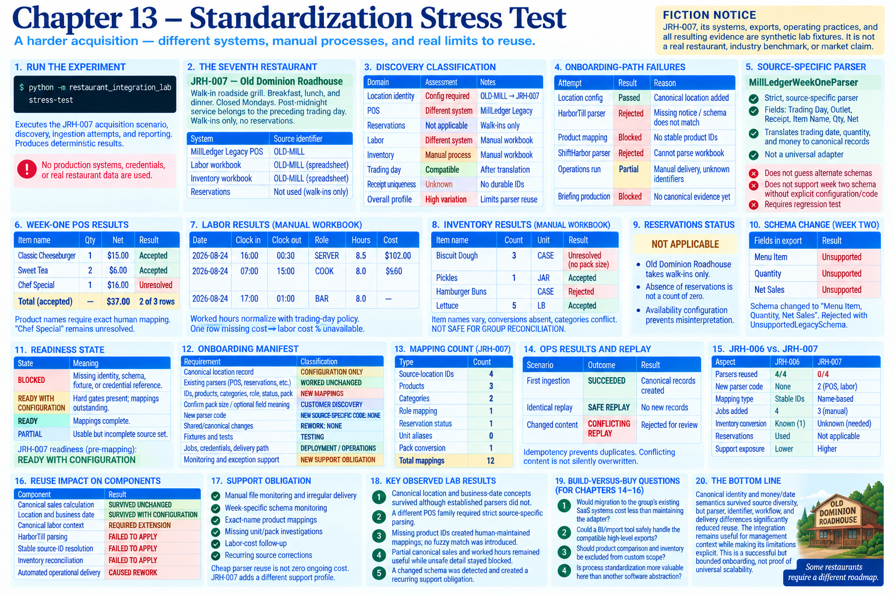

# Chapter 13 — Standardization Stress Test



> **Fiction notice:** JRH-007, its systems, exports, operating practices, and all resulting evidence are synthetic lab fixtures, not claims about a real restaurant or industry norms.

## Run the experiment

```bash
python -m restaurant_integration_lab stress-test
```

## 1. Why this acquisition is the stress test

Chapter 12 deliberately selected a mostly compatible sixth restaurant. Chapter 13 selects **Old Dominion Roadhouse (`JRH-007`)**, a recently acquired walk-in roadside grill, because its management needs remain relevant to James River Hospitality Group while its systems and workflows do not. This is the hardest integration so far and is intended to locate the boundary of reuse—not preserve the original `PROMISING` modeled verdict.

## 2. System landscape

The fictional restaurant uses MillLedger Legacy POS, a manager-maintained labor workbook, and a manually edited inventory workbook. Files arrive irregularly through a shared-folder drop and history covers only three weeks. The source calls the location `OLD-MILL`; labor and inventory rows have no durable record IDs. It is closed Mondays, assigns post-midnight service to the preceding trading day, and takes walk-ins only. Reservation evidence is therefore **NOT APPLICABLE**, never a count of zero.

## 3. Standardization gaps and discovery

Discovery is executable in `DISCOVERY` and classifies each domain using the required concrete vocabulary. Location identity needs configuration. POS and labor are different systems requiring adapters. Inventory and delivery are manual processes. Trading-day data is different-system but canonically compatible after translation. Reservations are unavailable because they do not apply. Receipt uniqueness remains unknown pending discovery. No composite score conceals these differences.

The standardization profile is consequently: different POS family/new adapter; no reservations; manual labor/new parser; manual inventory/unstable identity; compatible canonical location; compatible business date after translation; and a potentially compatible briefing after normalization.

## 4. Existing onboarding-path failures

The Chapter 12 path is attempted before the new parser. Canonical location configuration passes. The HarborTill parser visibly rejects the missing synthetic notice/different schema; stable-ID product mapping is blocked because IDs do not exist; ShiftHarbor cannot parse the workbook; operations are partial because delivery is manual; and briefing production is blocked until canonical evidence exists. These failures remain first-class report output.

## 5. Minimum source-specific engineering

`MillLedgerWeekOneParser` is a strict, source-specific parser for `Trading Day,Outlet,Receipt,Item Name,Qty,Net`. It translates the trading date, quantity, and money into existing canonical records. It is not a universal adapter. A separate manual labor boundary preserves worked versus scheduled hours, validates the explicit overnight timestamps, maps local roles, and deliberately omits labor cost measures when one row has no cost.

## 6. Weak identifiers

Chapter 12 used stable namespaced source IDs. JRH-007 supplies product names only. The acquisition fixture therefore uses a human-approved exact-name map for `Classic Cheeseburger` and `Sweet Tea`. Lowercase, misspelled, or merely similar values do not resolve. `Chef Special` remains unresolved. This is explicitly a **HUMAN-MAINTAINED NAME-BASED MAPPING**, with greater recurring support exposure, not fuzzy or AI matching.

## 7. Schema instability

The second export changes the fields to `Menu Item,Quantity,Net Sales`. The week-one parser rejects it with `UnsupportedLegacySchema`. It neither guesses aliases nor silently accepts the new format. Supporting week two would require explicit source-specific configuration/code plus a regression test, creating recurring schema-monitoring work.

## 8. Partial normalization

Two of three week-one lines normalize. Their canonical net sales of `$37.00`, location, business date, and worked labor hours are safe partial evidence. One product line remains blocked, so complete product comparisons are limited. Inventory is **NOT SAFE FOR GROUP RECONCILIATION**: item names vary, case/jug conversions are absent, categories conflict, and one count is blank. The implementation does not force unsafe normalization.

## 9. Management briefing limitations

The shared briefing receives canonical JRH-007 sales and labor context. It displays partial sales, one excluded product row, missing labor cost percentage, and reservations as NOT APPLICABLE. Chapter 13 extends the reservation availability configuration so that absence cannot masquerade as zero. Inventory reconciliation remains unsupported and data-quality investigation remains high. Briefing calculations survive; availability configuration and limitation presentation remain visible.

## 10. Operational burden

Three weekly job definitions identify the manual POS, labor, and inventory drops, their source-specific schemas, credential reference, input paths, and manual correction policy. A nominal weekly cadence does not claim automatic delivery: operators must monitor irregular arrival, schema shape, and source corrections.

## 11. Support burden

The recurring surfaces are manual file monitoring, week-specific schema monitoring, exact-name mappings, missing unit/pack investigations, labor-cost follow-up, and recurring source corrections. Chapter 12 added mappings, jobs, credential references, and a path; Chapter 13 adds qualitatively different human dependencies. No hours or commercial costs are inferred.

## 12. JRH-006 versus JRH-007

The deterministic `COMPARISON` records systems/parsers reused, new parsers, stable and unstable mappings, validation, shared/canonical model changes, operational configuration, unresolved evidence, briefing limits, and support obligations. JRH-006 reused four systems and four parsers with no new parser; JRH-007 reused no source system/parser unchanged and required two ingestion boundaries. Both retain canonical location and sales concepts. JRH-007 adds three manual-drop jobs and unresolved product, labor-cost, and inventory evidence.

## 13. Reuse erosion

Concrete component results replace a score:

* canonical sales calculation — **SURVIVED UNCHANGED**;
* location and business date — **SURVIVED WITH CONFIGURATION**;
* canonical labor context and briefing — **REQUIRED EXTENSION**;
* HarborTill parsing, stable source-ID resolution, and inventory reconciliation — **FAILED TO APPLY**;
* automated operational delivery — **CAUSED REWORK**.

## 14. Benefits that depended on standardization

Canonical identity and money/date semantics survived source diversity after explicit translation. Parser reuse depended directly on interface compatibility. Stable identifiers constrained mapping and support burden. Automated operational reuse depended on consistent delivery. Detailed group comparisons depended on aligned product and inventory processes. The implementation therefore preserves higher-level usefulness while showing exactly where the shared-systems/workflows premise weakened.

## 15. Process standardization versus abstraction

Another generalized adapter would not create stable product IDs, pack conversions, reliable delivery, complete labor costs, or a source owner. Standardizing the restaurant's processes or systems may remove recurring ambiguity more effectively than abstracting more header variants. That is pressure against custom software, not a resolved procurement recommendation.

## 16. Build-versus-buy questions

The lab records for Chapters 14–16, without answering them:

1. Would migration to the group's existing SaaS systems cost less than maintaining the adapter?
2. Could a BI/import tool safely handle the compatible high-level exports?
3. Should product comparison and inventory be excluded from custom scope?
4. Is process standardization more valuable here than another software abstraction?

## Observed lab results

* Canonical location and business-date concepts survived although the established source parsers did not.
* A different POS family required strict source-specific parsing.
* Missing product IDs created human-maintained mappings; no fuzzy match was introduced.
* Partial canonical sales and worked hours remained useful while unsafe detail stayed blocked.
* A changed schema was detected and created a recurring support obligation.

The engineering ledger contains structural work categories only. It has no fabricated hours, delivery cost, Chapter 14 assessment, or build-versus-buy conclusion.
