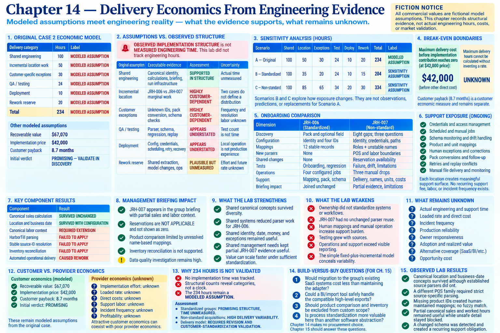

# Chapter 14 — Delivery Economics From Engineering Evidence

> **Fiction and evidence notice:** All commercial values are inherited fictional **MODELED ASSUMPTIONS**. Chapters 3–13 produced **OBSERVED IMPLEMENTATION STRUCTURE**, not measured developer time. This lab did not track engineering hours.

Run `python -m restaurant_integration_lab economics`. The structured conclusion is in the [Chapter 14 ledger](../evidence/chapter-14-economics-ledger.json).

## 1. Original Case 2 economic model

| Delivery category | Hours | Label |
|---|---:|---|
| Shared engineering | 100 | MODELED ASSUMPTION |
| Incremental location work | 50 | MODELED ASSUMPTION |
| Customer-specific exceptions | 30 | MODELED ASSUMPTION |
| QA / testing | 24 | MODELED ASSUMPTION |
| Deployment | 10 | MODELED ASSUMPTION |
| Rework reserve | 20 | MODELED ASSUMPTION |
| **Total** | **234** | **MODELED ASSUMPTION** |

Recoverable value **$67,070**, implementation price **$42,000**, customer payback **8.7 months**, and `PROMISING — VALIDATE IN DISCOVERY` were also modeled assumptions.

## 2. Assumptions versus observed structure

The lab can inspect modules, parsers, mappings, configuration, fixtures, tests, exceptions, jobs, rework, onboarding, and support surfaces. It cannot infer how long a human took to create them. **OBSERVED IMPLEMENTATION STRUCTURE is not MEASURED ENGINEERING TIME**; measured hours are `NONE`.

## 3. Evidence matrix and assessments

| Original assumption | Executable evidence | Assessment | Uncertainty |
|---|---|---|---|
| Shared engineering: 100h | Canonical identity/date/provenance/calculations, exceptions, briefing, run infrastructure | SUPPORTED IN STRUCTURE | Actual time unmeasured |
| Incremental location: 50h | JRH-006 configuration/mappings/jobs versus JRH-007 discovery/adapters/manual operations | HIGHLY CUSTOMER-DEPENDENT | Two cases do not define a distribution |
| Customer exceptions: 30h | Unknown identities, pack conversion, exact-name mapping, missing costs, schema drift | HIGHLY CUSTOMER-DEPENDENT | Frequency and resolution labor unknown |
| QA/testing: 24h | Per-source parser/schema tests, regression, replay/recovery, limitations | APPEARS UNDERSTATED | Test count is not time |
| Deployment: 10h | Configuration, credentials, scheduling, readiness, idempotency, retry, logging, recovery | APPEARS UNDERSTATED | Local operation is not production experience |
| Rework: 20h | Shared extraction, domain result changes, inventory identity revision, operations, JRH-007 extension | PLAUSIBLE BUT UNMEASURED | Effort and future rate unknown |

## 4. Shared engineering

Canonical location, business date, provenance, exact calculations, exceptions, briefing, and run concepts survived multiple domains. This supports shared structure, but cannot validate that 100 hours was enough or necessary.

## 5. Incremental location work

JRH-006 was predominantly configuration, mappings, tests, operations, and limited discovery without parser/canonical changes. JRH-007 required discovery, new ingestion boundaries, unstable mappings, manual delivery, shared availability changes, and incomplete comparisons. Incremental work is not a stable unit; it depends strongly on standardization.

## 6. Customer-specific exceptions

Chapters 6–9 accumulated status mappings, unknown identities, schema checks, pack conversion, and incomplete-batch review. JRH-007 added name-only products, drift, missing labor cost, absent conversions, and manual-source corrections. Their recurrence remains unknown.

## 7. Testing economics

Testing was **both shared and incremental**. Regression protects canonical behavior and earlier locations; every domain/source added parser, schema, validation, exception, and calculation scenarios. Chapters 11–13 added replay, readiness, onboarding, failure, partial-usefulness, and limitation checks. QA was not a one-time final phase, but test lines are not hours.

## 8. Deployment and operations

Deployment was not “copy code to server.” Chapter 11 made configuration, secret references, scheduling, idempotency, retry semantics, logs, readiness, health, and recovery executable. JRH-006 added compatible jobs; JRH-007 added irregular manual-drop monitoring. This breadth makes 10 hours appear understated without supplying a replacement estimate.

## 9. Rework economics

Location #2 caused shared extraction while disproving parser reuse; reservations exposed the sales-shaped result; labor extended its record; inventory disproved menu-product identity as stock identity; operations exposed reliability work; JRH-007 required availability presentation and exposed drift. This is rework-reserve evidence, not measured rework time.

## 10. Standardized versus non-standard onboarding

| Dimension | JRH-006 — MOSTLY STANDARDIZED | JRH-007 — NON-STANDARD ACQUISITION |
|---|---|---|
| Discovery | Pack and optional field | Eight gaps; three questions |
| Configuration | Identity and four IDs | Identity, credentials, paths, three manual jobs |
| Mappings | 12 stable records | Roles plus unstable exact names |
| New parsers | None | POS and manual labor boundaries |
| Shared changes | None | Reservation `NOT APPLICABLE` extension |
| Tests | Onboarding, regression, replay | Failure, partial evidence, drift, limitations |
| Operations | Four configured jobs | Three irregular manual drops |
| Support | Mapping, pack, schema, credentials | Delivery, drift, names, units, costs, corrections |
| Briefing | Joined unchanged | Partial evidence with limitations |

A standardized location is mostly configuration/mapping/testing/operations and less shared engineering. A non-standard one additionally needs discovery, parsing, unstable mapping, exceptions, operational variation, and support.

## 11. Support exposure

Recurring surfaces include credentials, scheduled/manual jobs, schemas, paths, mappings, human exceptions, pack conversions, retries, replay conflicts, corrections, and manual files. Each location creates **meaningful**, not zero, support surface. No recurring support fee, labor, or incident frequency exists to validate profitability.

## 12. Customer versus provider economics

Customer economics retain modeled value, price, and payback. Provider economics require effort, cost/rate, direct costs, contribution, and support burden. Actual effort, rate, direct cost, support labor, and frequency are absent. Attractive customer economics can coexist with poor provider economics.

## 13. Sensitivity analysis

| Scenario | Shared | Location | Exceptions | Test | Deploy | Rework | Total | Label |
|---|---:|---:|---:|---:|---:|---:|---:|---|
| A — Original | 100 | 50 | 30 | 24 | 10 | 20 | 234 | MODELED ASSUMPTION |
| B — Standardized | 100 | 35 | 20 | 24 | 10 | 15 | 204 | SENSITIVITY ASSUMPTION |
| C — Non-standard | 100 | 85 | 65 | 34 | 20 | 30 | 334 | SENSITIVITY ASSUMPTION |

B/C ask how exposure changes. They are not observations, predictions, or replacements for A. No delivery cost is calculated because no engineering cost/rate exists.

## 14. Break-even boundaries

At the modeled $42,000 price, maximum delivery cost before implementation contribution reaches zero is **$42,000**, before other direct cost. Maximum delivery hours cannot be calculated without inventing a rate. Customer payback remains separate.

## 15. What the lab strengthened

Shared ownership supported one briefing. Shared systems reduced parser work for JRH-006. Shared identity, date, money, provenance, and exceptions survived diversity. Shared management needs kept partial JRH-007 evidence useful. Value *can* scale faster under sufficient standardization.

## 16. What the lab weakened

Ownership did not standardize systems/workflows. JRH-007 had no unchanged parser reuse, introduced human mappings/manual operation, and limited detail. Testing grew with sources; operations/support exceeded visible reporting. The simple fixed-plus-incremental model conceals variability.

## 17. What remains unknown

Actual engineering/support time, loaded rate, incident frequency, production reliability, owner responsiveness, adoption, realized value, alternative coverage, and opportunity cost remain unknown. Two marginal cases do not define probabilities.

## 18. Why 234 hours is not validated

No historical developer time was tracked. Structural counts reveal categories and differences, not a clock. The **234 hours remain a MODELED ASSUMPTION**. Assessment: standardized groups show **PROMISING STRUCTURE, TIME UNMEASURED**; non-standard acquisitions show **HIGH DELIVERY VARIABILITY**; the delivery model **REQUIRES REVISION AND CUSTOMER-STANDARDIZATION VALIDATION**.

## 19. What Chapter 15 must ask

Build versus buy remains unresolved. Chapter 15 must compare restaurant SaaS, multi-location reporting, BI/configuration, automation, improved process/spreadsheets, narrower integration, and doing nothing—and choose `BUY / CONFIGURE` if custom differentiation is weak. Chapter 14 makes no procurement choice.

## Observed lab results

* **OBSERVED LAB RESULT:** Shared canonical concepts survived more locations and systems than individual source parsers did.
* **OBSERVED LAB RESULT:** JRH-006 and JRH-007 required materially different categories of marginal work.
* **OBSERVED LAB RESULT:** Production-style operation introduced reliability and support responsibilities beyond reporting.
* **OBSERVED LAB RESULT:** The original 234-hour estimate remains unvalidated because no implementation time was measured.
