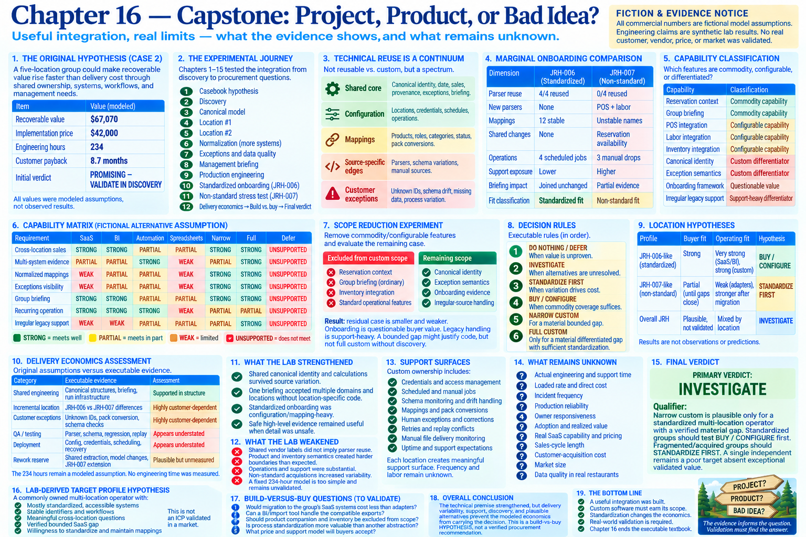

# Chapter 16 — Capstone: Project, Product, or Bad Idea?



> **Fiction and evidence notice:** The commercial numbers remain fictional **MODELED ASSUMPTIONS**. Engineering claims below are **OBSERVED LAB RESULTS** from synthetic fixtures. Sensitivity scenarios remain **SENSITIVITY ASSUMPTIONS**, and purchased-product coverage remains a **FICTIONAL ALTERNATIVE ASSUMPTION**. No real customer, vendor, price, or market was validated.

Run the final assessment with `python -m restaurant_integration_lab capstone`. Its rules and evidence inventory live in `capstone.py`; this chapter explains the conclusion rather than replacing the executable result.

## 1. The original hypothesis

Case 2 proposed that a five-location group could make recoverable value rise faster than delivery cost because shared ownership, systems, workflows, and management needs would create reusable infrastructure. Its $67,070 recoverable value, 234 engineering hours, $42,000 price, 8.7-month payback, and `PROMISING — VALIDATE IN DISCOVERY` verdict were modeled—not observed.

The lab supports only part of the mechanism. Shared ownership produced a real shared synthetic problem and one briefing. Shared systems reduced marginal engineering for standardized JRH-006, but not for acquired JRH-007. Shared workflows produced reusable concepts rather than identical implementations. Shared management needs supported one reusable artifact. Monetary value scaling was never tested.

## 2. Experimental journey

```text
CASEBOOK HYPOTHESIS → DISCOVERY → CANONICAL MODEL → LOCATION #1
→ LOCATION #2 → NORMALIZATION → MORE SYSTEMS → EXCEPTIONS → BRIEFING
→ PRODUCTION ENGINEERING → STANDARDIZED ONBOARDING
→ NON-STANDARD STRESS TEST → DELIVERY ECONOMICS → BUILD VS BUY
→ FINAL VERDICT
```

Discovery first exposed interface, identity, date, and process variation. Two POS integrations separated reusable canonical behavior from source parsing. Reservations, labor, and inventory tested domain boundaries; inventory required distinct stock identity and explicit conversions. Exceptions and provenance made uncertainty visible. The briefing then proved that compatible evidence could support one management artifact. Production engineering exposed scheduling, credentials, retries, idempotency, monitoring, and recovery. Finally, JRH-006 and JRH-007 tested opposite marginal-location shapes before Chapters 14 and 15 challenged the economics and procurement premise.

## 3. Technical reuse is a continuum

The lab rejects `REUSABLE vs CUSTOM`. Its stronger model is:

```text
SHARED CORE + CONFIGURATION + MAPPINGS + SOURCE-SPECIFIC EDGES + CUSTOMER EXCEPTIONS
```

Canonical location identity, business date, sales, provenance, the exception model, and the management briefing showed strong reuse. Operations were largely configuration reuse. Reservations stayed domain-specific. Labor and onboarding were conditional. Product/inventory identity was eroded by unit, pack, and source variation. Individual parsers remained source-specific even when their canonical destinations survived.

## 4. Standardization and marginal onboarding

JRH-006 reused established parsers, added stable mappings and jobs, and joined the briefing without shared-code or canonical-model changes. JRH-007 required new strict/manual boundaries, unstable name mappings, schema-drift handling, partial evidence, manual jobs, and a small briefing availability extension. Thus marginal delivery is structurally favorable only under high standardization; the lab supplies no measured marginal hours.

The executable qualification boundary calls an existing source family, known schema, stable identifiers, existing mapping mechanisms, and an existing operational workflow a **STANDARDIZED FIT**. Bounded differences are a **PARTIAL FIT**. New source families, unstable identifiers/manual processes, recurring schema instability, and significant exceptions are a **NON-STANDARD FIT**. This is a conceptual gate, not a universal score.

## 5. Support and discovery

Support is a **MEANINGFUL SUPPORT SURFACE**, not negligible. The lab demonstrated credential references, scheduled and manual jobs, delivery paths, schemas, mappings, human exceptions, pack conversions, retry/replay behavior, corrections, irregular files, monitoring, and recovery. Incident frequency and support labor remain unknown and highly customer-dependent.

Responsible pricing requires substantial qualification: source/system inventory, interfaces and samples, identifiers, existing reports, reservation applicability, labor semantics, inventory process, SaaS coverage, accessibility, data quality, and standardization. Discovery is therefore part of sales economics, not free prelude.

## 6. Delivery economics

Chapter 14 found shared structure, customer-dependent marginal and exception work, apparently understated QA/deployment categories, and unmeasured rework. The original 234 hours remain an unvalidated **MODELED ASSUMPTION**. Recoverable value remains modeled. Standardized delivery looks structurally better; non-standard delivery introduces major variability; operational/support work is material. The technical premise strengthened, while the economic model weakened, became more conditional, and remains insufficiently validated.

## 7. Build versus buy and custom differentiation

Chapter 15 classified the ordinary briefing and reservation context as commodity; sales, labor, inventory, and operations as configurable; canonical identity and customer exception semantics as custom differentiators; onboarding as questionable buyer value; and irregular legacy handling as support-heavy differentiation. Purchased alternatives were fictional assumptions, not researched facts.

Full custom did not survive scope reduction. A narrow POS/labor/identity/briefing integration could be justified only if discovery verifies a material bounded gap. A standardized profile also creates the strongest SaaS/BI competition, producing `BUY / CONFIGURE` first. A fragmented profile creates more unusual custom needs but worse delivery economics, producing `STANDARDIZE FIRST`. Overall, Chapter 15 said `INVESTIGATE`, and the capstone preserves it.

## 8. Project versus product

The evidence supports a **REPEATABLE CUSTOM SERVICE / PRODUCTIZED DELIVERY**, not a software product. The productizable core includes canonical identity, mappings, exceptions, operational run behavior, and briefing structures. The service edge includes discovery, adapters, mappings, source-specific exceptions, and customer standardization. Reusable code is necessary but insufficient evidence of repeatable market needs, interfaces, and low customer-specific engineering.

## 9. Lab-derived customer profiles

The **LAB-DERIVED TARGET PROFILE HYPOTHESIS** is a commonly owned multi-location operator with mostly standardized accessible systems, stable identifiers, meaningful cross-location questions, a verified bounded SaaS gap, and willingness to standardize and maintain mappings. This is not an ICP validated in a market.

The poor-fit hypothesis is a single/small operator or fragmented acquisition group with manual inconsistent processes, unstable identity, weak management need, high exception burden, a strong native alternative, or refusal to standardize. Case 2 remains structurally different from Case 1 because shared infrastructure served multiple locations, but its numerical advantage remains unvalidated.

## 10. What the lab strengthened

* Shared canonical identity, provenance, exception semantics, and calculations survived meaningful source variation.
* One briefing accepted multiple domains and later locations without location-specific reporting code.
* Standardized onboarding was configuration/mapping-heavy rather than parser-heavy.
* Safe high-level evidence sometimes remained useful when detailed normalization was unsafe.

## 11. What the lab weakened

* Shared vendor labels did not imply parser reuse.
* Product and inventory semantics created harder boundaries than a simple shared model implied.
* Production operation and support were substantial parts of delivery.
* Non-standard acquisitions made marginal work and support highly variable.
* A fixed 234-hour total is too simple to describe the demonstrated delivery shapes and was not validated.

## 12. What the lab did not validate

Actual engineering hours, actual restaurant customer value, willingness to pay, support-incident frequency, real SaaS capability/pricing, sales-cycle length, customer-acquisition cost, and real restaurant data quality remain unknown. The lab also did not measure adoption, production reliability, market size, or repeatability across customers.

## 13. Final verdict

**PRIMARY VERDICT: INVESTIGATE.**

**Qualifier:** narrow custom is plausible only for a standardized multi-location operator with a verified material gap. Standardized groups should test `BUY / CONFIGURE` first. Fragmented/acquired groups should `STANDARDIZE FIRST`. A single independent remains a poor target absent exceptional validated value.

This is less enthusiastic than the original verdict, not because the shared technical premise failed, but because delivery variability, support, discovery, and plausible alternatives prevent the modeled economics from carrying the decision.

## 14. Real-world validation required

1. Do real 5–20 location operators have these cross-system management questions?
2. How standardized are their systems, interfaces, identifiers, and workflows?
3. Which native SaaS/BI capabilities already answer the questions?
4. Can representative exports be inspected before pricing?
5. How many mappings, exceptions, and corrections occur in real data?
6. Is the differentiated identity/exception gap material and bounded?
7. What implementation price and support model will buyers accept?

There is no Chapter 17. The executable textbook ends with this evidence-constrained verdict.
